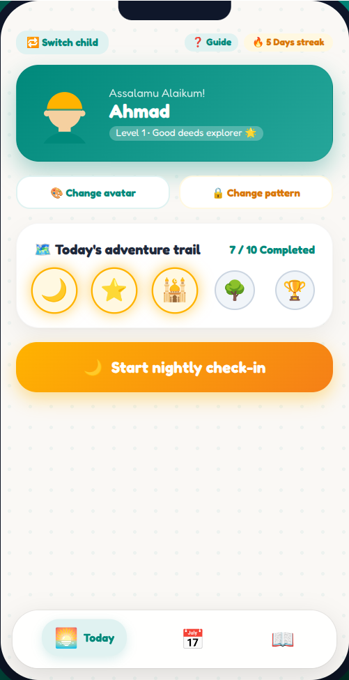
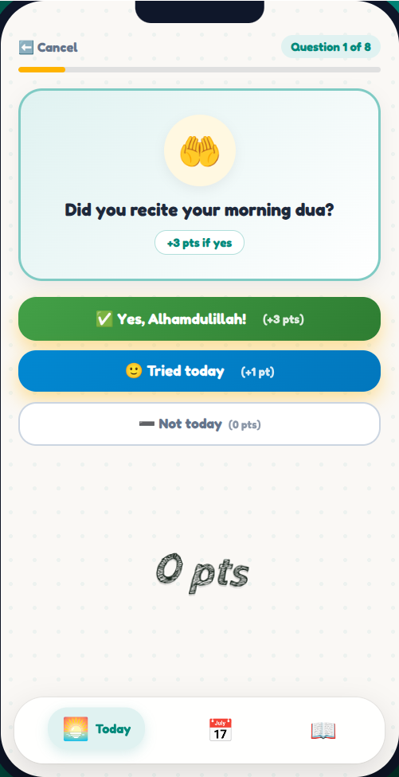
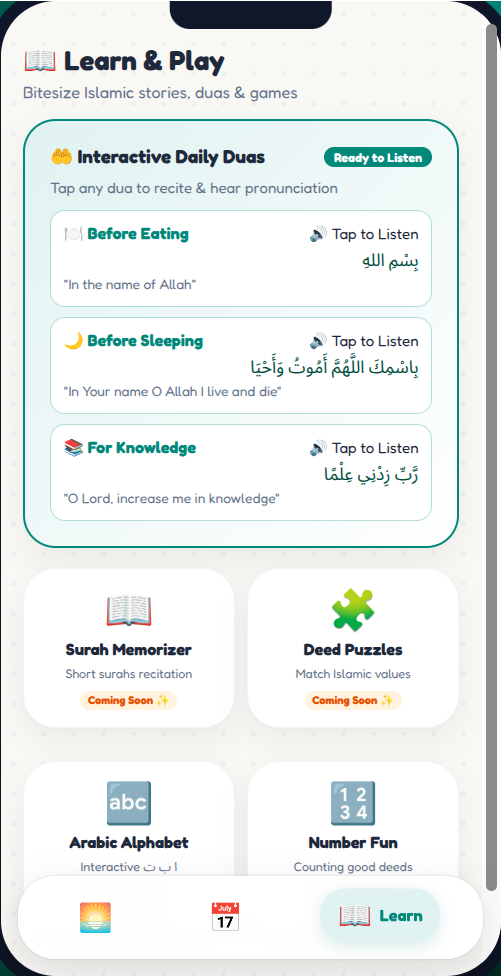

# Kids good-deeds app

A Flutter app and interactive web prototype for a gentle family check-in about daily good deeds, Islamic manners, and positive habits.

<p align="center">
    
    
    
</p>

<p align="center"><em>Current web preview screens. The preview uses sample data and is separate from the Flutter app.</em></p>

## What works

- First-time onboarding, child profiles, faceless avatars, and child pattern locks.
- A one-question-at-a-time nightly check-in with scored answers, gentle feedback, and a results screen.
- Parent PIN, child management, habit and reward editing, and a scratch-card reward screen.
- Learning screens for short surahs, duas, Arabic letters, and a sticker garden.
- Local persistence for child profiles, settings, deeds, rewards, and check-in history.

## Current limitations

- The parent PIN is stored in ordinary local preferences and is not encrypted.
- Journey monthly points, completed deeds, check-in days, weekly trends, and date details are calculated from saved check-ins. The family leaderboard and seeded web-preview profiles remain sample data.
- Flutter voice feedback uses device text-to-speech; the web preview has a matching Parent settings → Test voice control using browser speech synthesis. Both prefer a male-sounding English voice when identifiable, but available voices vary by device/browser and recordings are not bundled. If the preview reports no browser voice, enable an English text-to-speech voice in device settings or test on a device/browser that provides one.
- The web preview is a separate prototype and can differ from Flutter behavior.

## Run it

Flutter app:

```bash
flutter pub get
flutter run
```

Interactive web preview:

```bash
npm --prefix web_preview install
npm --prefix web_preview run dev
```

Tests:

```bash
flutter test
```

## Project docs

- [Product blueprint and requirements](kids_islamic_good_deeds_app_mockup_prompt.md)
- [Implementation status and handoff notes](PROJECT_CONTEXT_SUMMARY.md)
